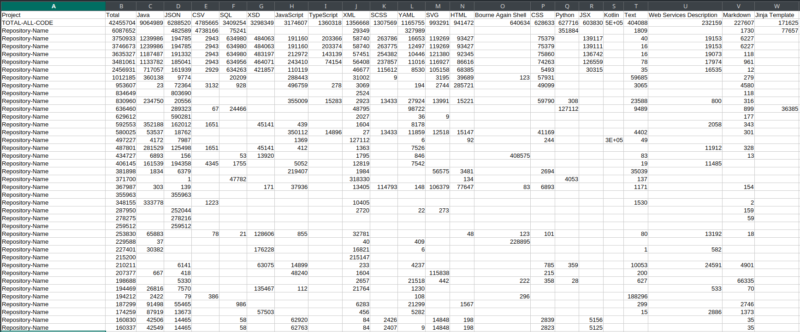

### Script for Collecting Total LOC (Lines of Code) and Further Sorting by Projects, Languages, and Total Code Count Across Different Languages.

##### In your GitLab account settings, create an access token with read_api and read_repository permissions.

**Download and install CLOC on your PC:**  
https://github.com/AlDanial/cloc  

**Download the project:**  
git clone "https://github.com/casinoazino/Gitlab_LOC.git"  
Navigate locally to the directory of the downloaded project  

**In the file get_repos.py, replace:**  
gitlab_domain = 'https://YOU_DOMAIN'  
personal_access_token = 'YOU_TOKEN'  

**In the file scrape_repos.py, replace:**  
token = "YOU_TOKEN"  
gitlab_domain = "DOMAIN_NAME_WITOUT_HTTPS://"  

**Install additional modules:**  
pip install -r requirements.txt

**Run the script:**  
python3 start.py
